# Lumi — HumanOS

> **The first AI operating system for humans.**
> Not another reminder app. Not another chatbot wrapper.
> An autonomous agent that perceives, plans, intervenes, and learns — to make you do what you said you would.

---

## The Vision

Most productivity tools assume humans are rational. They give you a to-do list and hope for the best. **Lumi assumes you won't do it** — and builds an entire operating system around making sure you do.

```mermaid
graph LR
    P["🔍 PERCEIVE<br/><br/>HealthKit · Camera<br/>Voice · Behavior"] --> M["🧠 MODEL<br/><br/>Memory RAG<br/>6-Tag User Profile"]
    M --> PL["📋 PLAN<br/><br/>Active Inference<br/>Goal Auto-Adjust"]
    PL --> I["🤚 INTERVENE<br/><br/>VoIP Call · Screen Lock<br/>HomeKit · Coaching"]
    I --> V["✅ VERIFY<br/><br/>Visual AI<br/>Photo · Pledge"]
    V --> L["📚 LEARN<br/><br/>Memory Extraction<br/>Behavior Analysis"]
    L --> P

    style P fill:#4A90D9,stroke:#2C5F8A,color:#fff
    style M fill:#7B68EE,stroke:#5B48CE,color:#fff
    style PL fill:#E67E22,stroke:#C0651A,color:#fff
    style I fill:#E74C3C,stroke:#C0392B,color:#fff
    style V fill:#2ECC71,stroke:#27AE60,color:#fff
    style L fill:#9B59B6,stroke:#8E44AD,color:#fff
```



The agent doesn't just remind you. It **calls you**. If you don't answer, it **locks your phone**. It watches you work through your camera. It learns your procrastination patterns. It adjusts your goals when you're struggling. It controls your lights when it's time to sleep.

**This is what "AI agent" actually means.**

---

## Why This is Different

| Feature         | Typical AI App                   | HumanOS                                                                                      |
| --------------- | -------------------------------- | -------------------------------------------------------------------------------------------- |
| Reminders       | Push notification you swipe away | **VoIP call** via CallKit — rings like a real phone call                                     |
| Accountability  | Honor system                     | **AI visual verification** — camera frames analyzed by Gemini                                |
| Consequences    | Guilt                            | **Screen Time lock** — apps blocked until you comply                                         |
| Personalization | Chat history window              | **Tiered RAG memory** — pgvector + MRR fusion, learns your emotional triggers and motivators |
| Goal setting    | Static targets                   | **Active Inference** — goals auto-adjust based on prediction error                           |
| Environment     | None                             | **HomeKit** — controls your lights, sets sleep scenes                                        |
| Health          | None                             | **HealthKit** — heart rate, sleep quality, HRV, steps                                        |

---

## System Architecture

```mermaid
graph TD
    HUMAN["👤 HUMAN"] --> IOS

    subgraph IOS["📱 iOS — Swift"]
        direction LR
        CK["📞 CallKit + PushKit"] ~~~ ST["🔒 Screen Time"] ~~~ HK["❤️ HealthKit"] ~~~ HMK["💡 HomeKit"]
    end

    IOS --> |"47 JS Bridge Handlers"| WEB

    subgraph WEB["🌐 React + Vite"]
        direction LR
        HOOKS["useAICoachSession<br/>(15+ composable hooks)"] ~~~ UI["5-Tab UI<br/>+ Campfire Focus"]
    end

    WEB --> |"HTTPS / WebSocket"| BACKEND

    subgraph BACKEND["⚡ Supabase Edge Functions"]
        direction LR
        MEM["Memory RAG<br/>extract · retrieve · compress"] ~~~ PROMPT["AI Prompt Engine<br/>1205-line system prompt"] ~~~ PUSH["Intervention<br/>VoIP · FCM · App Lock"]
    end

    BACKEND --> DB["🗄️ PostgreSQL + pgvector<br/>30+ tables · RLS · pg_cron"]
    BACKEND --> GEM["Gemini Live<br/>Realtime Voice + Video"]
    BACKEND --> GPT["GPT-5.1<br/>Memory Extraction"]
    BACKEND --> AZR["Azure OpenAI<br/>Embeddings (1536d)"]

    style HUMAN fill:#F39C12,stroke:#E67E22,color:#fff
    style IOS fill:#3498DB,stroke:#2980B9,color:#fff
    style WEB fill:#9B59B6,stroke:#8E44AD,color:#fff
    style BACKEND fill:#E74C3C,stroke:#C0392B,color:#fff
    style DB fill:#2C3E50,stroke:#1A252F,color:#fff
    style GEM fill:#4285F4,stroke:#1A73E8,color:#fff
    style GPT fill:#10A37F,stroke:#0D8C6D,color:#fff
    style AZR fill:#0078D4,stroke:#005A9E,color:#fff
```



---

## Core Systems

### Memory System — The Agent's Brain

Persistent user model built on **Multi-Query RAG with MRR (Mean Reciprocal Rank) fusion** over pgvector.

```mermaid
flowchart LR
    SPEAK["🗣️ User speaks"] --> SYNTH["LLM synthesizes<br/>3 search queries"]
    SYNTH --> EMBED["Azure OpenAI<br/>embeddings (1536d)"]
    EMBED --> HOT["🔴 Hot Tier<br/>7 days + PREF/EFF"]
    EMBED --> WARM["🟡 Warm Tier<br/>7–30 days"]
    EMBED --> COLD["🔵 Cold Tier<br/>30+ days"]
    HOT --> MRR["MRR Fusion<br/>ranked results"]
    WARM --> MRR
    COLD --> MRR
    MRR --> INJECT["💉 Hidden injection<br/>into Gemini Live"]

    style SPEAK fill:#4A90D9,stroke:#2C5F8A,color:#fff
    style SYNTH fill:#E67E22,stroke:#C0651A,color:#fff
    style EMBED fill:#9B59B6,stroke:#8E44AD,color:#fff
    style HOT fill:#E74C3C,stroke:#C0392B,color:#fff
    style WARM fill:#F39C12,stroke:#E67E22,color:#fff
    style COLD fill:#3498DB,stroke:#2980B9,color:#fff
    style MRR fill:#1ABC9C,stroke:#16A085,color:#fff
    style INJECT fill:#2C3E50,stroke:#1A252F,color:#fff
```



**6 memory tags:** `PREF` (AI preferences, always loaded), `EFFECTIVE` (motivators, always loaded), `PROC` (procrastination patterns), `EMO` (emotional triggers), `SOMA` (body reactions), `SAB` (self-sabotage behaviors). Memory lifecycle: Extract → Embed → Deduplicate → AI-merge → Score → Store → Tiered RAG retrieve → Compress when stale.

### Goal System — Active Inference Engine

Goals auto-adjust based on `prediction_error = actual_time − target_time`. 3 consecutive successes → advance (harder). 2 consecutive failures → retreat (easier). Boundary-checked against ultimate target and baseline. 7 goal types supported. Daily AI-scored reports via Gemini Flash.

### Intervention System — The Agent's Hands

**Escalation ladder:** each level increases friction.

| Level | Intervention      | Mechanism                                               |
| ----- | ----------------- | ------------------------------------------------------- |
| 1     | Push notification | Standard alert                                          |
| 2     | **VoIP call**     | CallKit incoming call UI — rings like a real phone call |
| 3     | **Screen lock**   | Apple Screen Time API — blocks all selected apps        |
| 4     | **Pledge gate**   | Must speak/type consequence pledge to unlock            |

Plus: **Gemini Live** realtime voice coaching (WebRTC, PCM 16kHz), **camera monitoring** (JPEG frames to AI), **HomeKit** environment control, **Dynamic Island** countdown, **background nudge** escalation (90s → 180s → disconnect).

### Verification & Reward

**AI visual verification** (Gemini 3 Flash analyzes camera frames, outputs confidence + evidence). **Photo verification** for leaderboard integrity. **Immutable coins ledger** with weekly seasons. **Physics-based celebration** (matter.js coin drop + confetti).

---

## Tech Stack

| Layer           | Technology                                                                     |
| --------------- | ------------------------------------------------------------------------------ |
| **Frontend**    | React 19, TypeScript 5.9, Vite 7, Tailwind CSS 3                               |
| **AI Realtime** | Gemini Live API — WebSocket, audio/video streaming, session resumption         |
| **Backend**     | Supabase — PostgreSQL + pgvector + 40+ Deno Edge Functions                     |
| **Memory**      | Multi-Query RAG, MRR fusion, HNSW index, tiered hot/warm/cold                  |
| **AI Models**   | GPT-5.1 (memory extraction), Gemini Flash (scoring), Azure OpenAI (embeddings) |
| **iOS Native**  | Swift 5.9 — CallKit, Screen Time, HealthKit, HomeKit, PushKit, Live Activity   |
| **Push**        | APNs VoIP + Alert, FCM, OneSignal                                              |
| **i18n**        | 6 languages (EN, ZH, JA, KO, IT, ES)                                           |


---

## Getting Started

```bash
# Web
npm install && npm run dev          # Start dev server
npm run dev:local                   # Connect to local Supabase
npm run dev:remote                  # Connect to cloud Supabase
npm run build && npm run lint       # Build + lint

# Environment
npm run use:local                   # Switch to local Supabase
npm run use:remote                  # Switch to cloud Supabase
```

---

## Platforms

| Platform    | Status     | Stack                                                           |
| ----------- | ---------- | --------------------------------------------------------------- |
| **iOS**     | Production | Swift — CallKit, Screen Time, HealthKit, HomeKit, Live Activity |
| **Web**     | Production | [meetlumi.org](https://meetlumi.org)                            |
| **Android** | Waitlist   | Planned                                                         |

---

## Docs

[Architecture](./docs/architecture/) · [Key Decisions](./docs/KEY_DECISIONS.md) · [Features](./docs/features/) · [Dev Guides](./docs/dev-guide/)

---

## License

Proprietary. All rights reserved.
